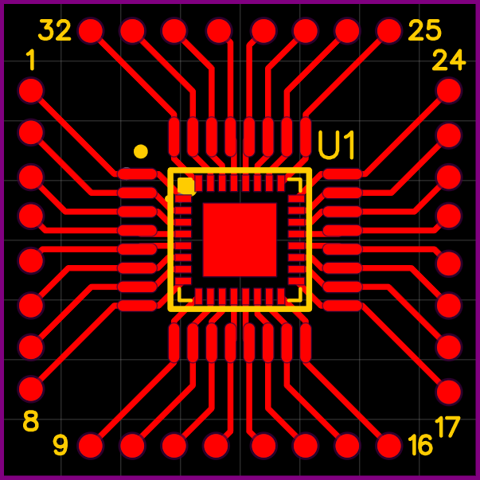

## TQFP32 / QFN32 Breakout Board (20.32 × 20.32 mm)

- ⚡ Exposes all 32 pins as SMT pads
- 📏 Board size: 20.32 × 20.32 mm (~413 mm²)
- 🛠 Designed in EasyEDA Std 6.5.51
- 🎯 Intended for ATmega328P and other TQFP32 / QFN32 chips
- ❌ No regulators, no crystal, no nonsense

Use at your own risk ⚡… if you add RGB LEDs, your soldering soul is on your own.

> Tip: Pads are **0.5mm diameter**, use fine soldering or a hot air station for best results.

[Download EasyEDA source](./easyeda/PCB.json)

## Contact
Questions, PCB collabs, or cursed MCU experiments? Reach me at: **ruzgarefecelik67@gmail.com**

Check my [YouTube channel](https://www.youtube.com/channel/UCh0Gprh0Ou6Ah2s-69SvjJQ) or [Custom ROM Vault](https://rom-kasasi.netlify.app/) for more cursed projects.
